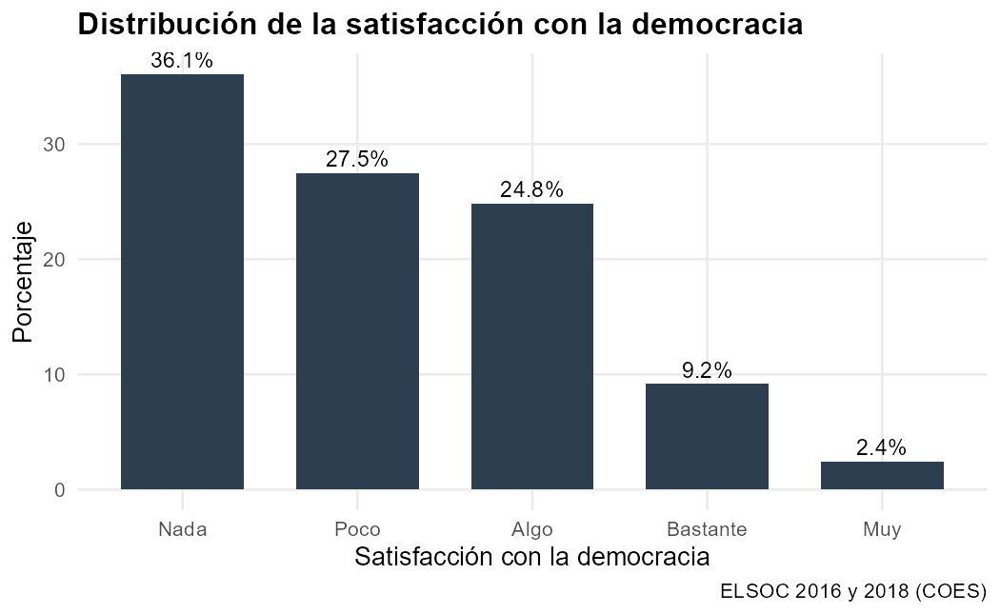
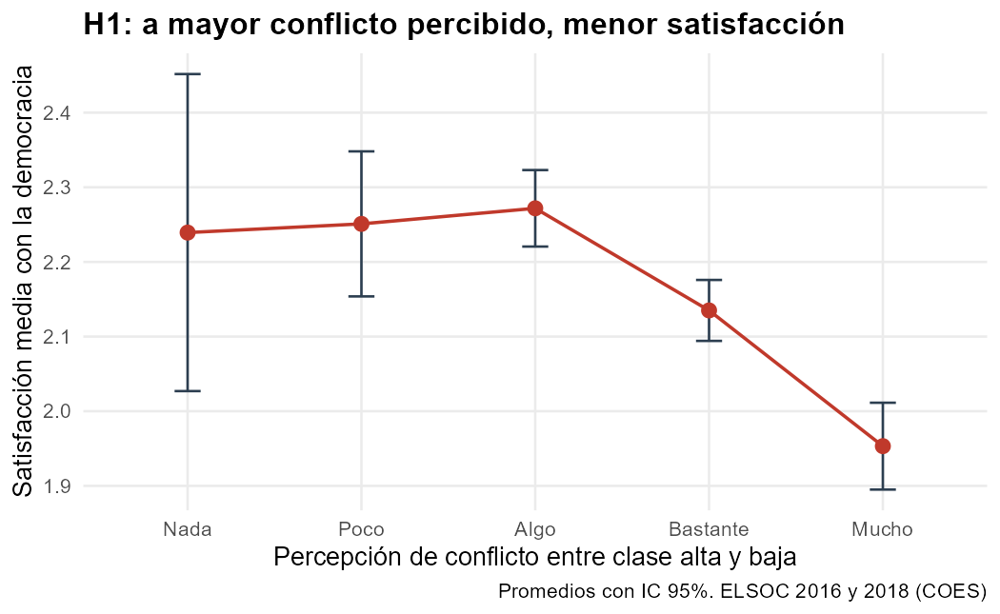
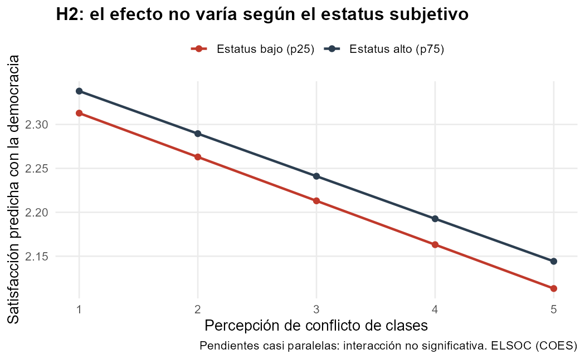

```{r}
#| label: setup-resultados
#| include: false
library(dplyr)
library(modelsummary)
modelos <- readRDS("output/modelos.rds")
vcovs   <- readRDS("output/vcovs.rds")
res     <- readRDS("output/resultados.rds")
p  <- function(x) ifelse(x < 0.001, "< 0,001", paste0("= ", formatC(x, format="f", digits=3, decimal.mark=",")))
n2 <- function(x) formatC(x, format="f", digits=2, decimal.mark=",")
```

## Descriptivos

La satisfacción con la democracia es **baja**: la media alcanza apenas
`r n2(res$media_satdem)` en una escala de 1 a 5 y un
**`r n2(res$pct_insatisf)`%** de las personas se declara *nada* o *poco* satisfecha
(@fig-desc). En paralelo, la percepción de conflicto entre clase alta y baja es
**alta y generalizada**: la media es `r n2(res$media_conflicto)` y un
**`r n2(res$pct_conflicto)`%** percibe *bastante* o *mucho* conflicto. El escenario
descriptivo ya sugiere la coexistencia de una democracia mal evaluada con una fuerte
percepción de antagonismo de clases.

{#fig-desc width=90%}

## H1: conflicto de clases y satisfacción con la democracia

El @fig-h1 muestra un descenso monótono: a medida que aumenta el conflicto percibido,
cae la satisfacción media con la democracia. Los modelos confirman el patrón
(@tbl-modelos). En el modelo bruto (M1) cada punto adicional de conflicto reduce la
satisfacción en `r n2(abs(res$b_conflicto_bruto))` puntos; al incorporar controles
(M2), la asociación se atenúa pero se mantiene **negativa y estadísticamente significativa**
(β = `r n2(res$b_conflicto)`, EE = `r n2(res$se_conflicto)`, *p* `r p(res$p_conflicto)`).
La atenuación se explica porque la **confianza en el gobierno** absorbe buena parte de la
varianza (β = `r n2(res$b_confgob)`, *p* `r p(res$p_confgob)`) y eleva el R² del modelo a
`r n2(res$r2_m2)`. **H1 recibe apoyo empírico.**

{#fig-h1 width=90%}

```{r}
#| label: tbl-modelos
#| tbl-cap: "Modelos MCO de la satisfacción con la democracia (errores agrupados por individuo)"
#| echo: false
#| warning: false
cm <- c("conflicto"="Conflicto percibido", "conflicto_c"="Conflicto percibido",
        "estatus"="Estatus subjetivo", "estatus_c"="Estatus subjetivo",
        "conflicto_c:estatus_c"="Conflicto × Estatus",
        "izqder"="Izquierda–derecha", "confgob"="Confianza gobierno",
        "mujer"="Mujer", "edad"="Edad", "anio2018"="Año 2018",
        "(Intercept)"="(Intercepto)")
modelsummary(modelos, vcov = vcovs, coef_map = cm,
             stars = c("*"=.05,"**"=.01,"***"=.001),
             gof_map = c("nobs","r.squared"),
             notes = "Errores estándar agrupados por individuo (cluster idencuesta) entre paréntesis. Fuente: ELSOC 2016 y 2018 (COES).",
             output = "kableExtra")
```

## H2: ¿modera el estatus subjetivo el efecto del conflicto?

El término de interacción `conflicto × estatus` (M3) es **prácticamente nulo y no
significativo** (β = `r n2(res$b_interaccion)`, *p* `r p(res$p_interaccion)`), y el R²
no mejora respecto de M2. Como ilustra el @fig-h2, las pendientes para personas de
estatus bajo (p25) y alto (p75) son casi paralelas: la asociación negativa entre conflicto
percibido y satisfacción democrática **es transversal**, sin intensificarse en los estratos
subjetivamente más bajos. **H2 no recibe apoyo empírico.**

{#fig-h2 width=90%}

Este resultado —un efecto principal robusto junto a una moderación nula— es precisamente
el tipo de hallazgo que el pre-registro permite reportar sin sesgo: la ausencia de
moderación no fue reinterpretada *a posteriori* buscando otro moderador significativo.
